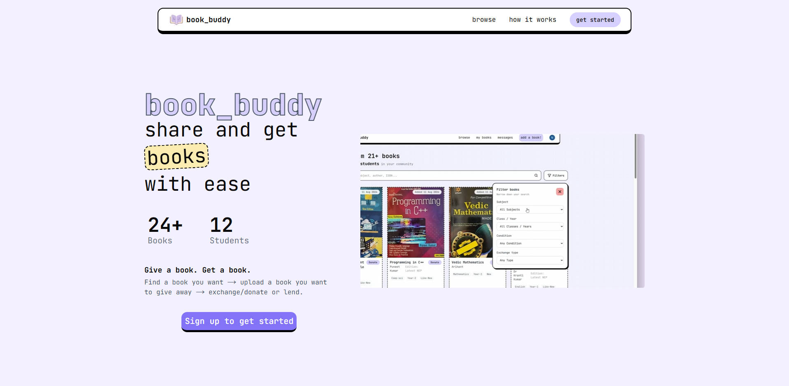

<div>
  
  <h1>book_buddy</h1>
</div>

**reuse books. save money. reduce waste.**

[](https://github.com/NishthaSharma-22/book_buddy/actions/workflows/playwright.yml)
[](https://www.typescriptlang.org/)
[](https://book-buddy-mu.vercel.app)

**[Live Demo →](https://book-buddy-mu.vercel.app)**

---

[](https://www.youtube.com/watch?v=1Ln4zs1YgWQ)
---

## Impact

- **24 books** listed by students
- **12+ exchanges** facilitated (donations, swaps, lends)
- Built for **[ourplanet.rocks](https://ourplanet.rocks)** — aligned with **UN SDG 12** (Responsible Consumption and Production)

---

## What it does

book_buddy is a peer-to-peer textbook exchange platform for students. Instead of buying a new textbook every year, students can find, request, and exchange books directly with each other.

It started from a simple observation: students already pass books to friends through word of mouth. book_buddy makes that discoverable at scale.

**give → chat → reuse** replaces **buy → use → store → repeat**

---

## Features

### User-facing
- List books with condition, edition, subject, grade, and exchange type (donate / swap / sell / lend)
- Browse with full-text search and filters by subject and grade
- Request a book → real-time chat opens with the owner
- Manage listings and track book status (available, lent, sold, given away, archived)
- Similar book recommendations when a listing is unavailable

### Technical
- **Real-time messaging** via Socket.io with conversation-room and user-room isolation
- **Full-text search** using MongoDB weighted text indexes (title ×3, author ×2, description ×1)
- **Infinite scroll** via Intersection Observer on the browse page
- **Rate limiting** on write endpoints using Upstash Redis sliding window (10 req / 60s per user)
- **MongoDB aggregation pipeline** for status-sorted, paginated book listings
- **Image upload** via Cloudinary with server-side stream processing and file-size validation
- **CI pipeline** with Playwright E2E tests running on every push to main, connecting to a real MongoDB instance via GitHub Secrets

---

## Tech Stack

| Layer | Tool | Why |
|---|---|---|
| Framework | Next.js 16 (App Router) | Server components + API routes in one repo; Vercel-native deployment |
| Language | TypeScript 5 | End-to-end type safety across models, API routes, and components |
| Styling | Tailwind CSS 4 | Utility-first; no runtime CSS overhead |
| Database | MongoDB + Mongoose | Flexible schema for evolving book metadata; compound indexes for filtered queries |
| Auth | Clerk | Handles OAuth, session management, and user metadata without a custom auth table |
| Real-time | Socket.io | Bidirectional WebSocket communication; room-based isolation per conversation |
| Rate limiting | Upstash Redis | Serverless Redis — no persistent connection, compatible with Vercel's stateless functions |
| Images | Cloudinary | Server-side upload stream, CDN delivery, automatic format optimization |
| Analytics | Vercel Analytics + Speed Insights | Real-user performance monitoring from day one |
| Testing | Vitest (unit) + Playwright (E2E) | Unit tests for utilities; E2E tests for full user flows |
| CI | GitHub Actions | Playwright tests run on every push to main with live DB secrets |
| Deployment | Vercel | |

---

## Architecture

The app uses **Next.js App Router** for server and client components. API routes handle data mutations; server components handle initial data fetches to avoid client-side waterfalls.

**Real-time layer:** Socket.io runs as a separate server (port 3001) alongside the Next.js app. Vercel's serverless functions can't hold persistent WebSocket connections, so the Socket.io server deploys separately. Each conversation gets its own room (`conversation:{id}`); each user has a notification room (`user:{id}`).

**Data layer:** Four Mongoose models — `Book`, `Conversation`, `Message`, `Notification` — with compound indexes designed for the core queries: paginated browse with status sort, full-text search, and per-user conversation lookups.

**Auth layer:** Clerk middleware runs at the edge, redirecting unauthenticated users before any page or API route is hit. Book ownership is re-validated at the API layer on every mutation.

---

## CI / Testing

Tests run automatically on every push to `main` and on every pull request via GitHub Actions.

```bash
npm run test:unit     # Vitest unit tests
npm run test:e2e      # Playwright E2E tests (requires env vars)
```

The Playwright suite connects to a real MongoDB instance and uses real Clerk credentials via GitHub Secrets — no mocking.

---

## Getting Started

### Prerequisites

You'll need accounts for: MongoDB Atlas, Clerk, Cloudinary, Upstash Redis, and Resend.

### Environment variables

```env
MONGODB_URI=
NEXT_PUBLIC_CLERK_PUBLISHABLE_KEY=
CLERK_SECRET_KEY=
NEXT_PUBLIC_CLOUDINARY_CLOUD_NAME=
CLOUDINARY_API_KEY=
CLOUDINARY_API_SECRET=
UPSTASH_REDIS_REST_URL=
UPSTASH_REDIS_REST_TOKEN=
```

### Run locally

```bash
npm install
npm run dev         # Next.js on port 3000
npm run socket      # Socket.io server on port 3001
```

---